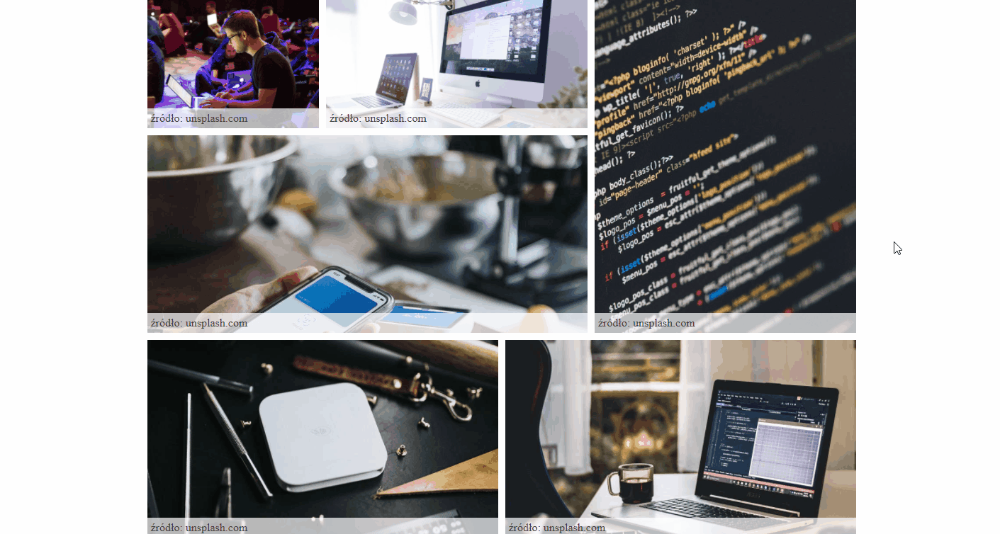

# JavaScript Slider - ES6+

- [Overview](#overview)
  - [The challenge](#the-challenge)
  - [Links](#links)
  - [Instalation](#instalation)
  - [How it works](#how-it-works)
- [My process](#my-process)
  - [Built with](#built-with)
  - [What I Learned](#what-i-learned)
- [Author](#author)
- [Special thanks](#special-thanks)

## Overview



### The challenge

This project was created to develop and improve my skills in JavaScript ECMAScript 2015+.
The task was to modificate one of my [previous project](https://github.com/KajetanKisielewski/JavaScript-Slider-Events-) using Javascript ES6+ and Events (including Customs Events). In the project, I tried to keep the code clean, guided by the principle of single responsibility.

### Links

- Code: [See my code](https://github.com/KajetanKisielewski/JavaScript-Slider-ES6-/tree/master/assets)
- Live: [Check it out](https://kajetankisielewski.github.io/JavaScript-Slider-ES6-/)

### Instalation

If you want to try a project, download it then use the command below in terminal

````
npm i
````

To run the project use the command below in terminal:
````
npm start
````

### How it works

The images are randomly grouped into two groups each time the page is reloaded.
After clicking on the selected image in gallery, a slide show is displayed, below the main image(selected) a collection of images from the same group is created.
The user can switch between the next / previous photo by clicking the selected arrow.
Hovering the mouse over the selected arrow stops the slideshow, moving beyond the arrow resumes the slideshow.
Clicking on the area around the main image closes the slideshow and returns to the gallery.

## My Process

### Built with

- HTML
- CSS
- JavaScript ES6+
- BEM methodology
- Webpack
- Babel

### What I learned

Working on this project allowed me to gain knowledge about new solutions in JS (ES6+) i.e. classes, moduls, template strings, arrow functions, destructuring, rest operator, spread operator, default values and Webpack. Not all of this solutions was useing in this project.
In the project, I also used the knowledge from previous projects, which allowed me to consolidate it even more.


## Author

- Github - [Kajetan Kisielewski](https://github.com/KajetanKisielewski)
- LinkedIn - [Kajetan Kisielewski](https://www.linkedin.com/in/kajetan-kisielewski-157b60208/)

## Special thanks

Thanks to my [Mentor - devmentor.pl](https://devmentor.pl/) - for providing me with this task and for code review.
